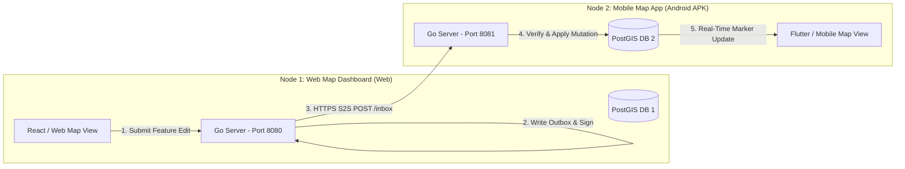

# 🌐 3.2.3 User Interface Design — Dual-Node Demonstration Prototype

> **Important Conceptual Note for Final Report**:  
> The primary focus of the **Fedratlas Map Project** is **NOT** to develop a proprietary commercial map rendering interface (such as custom tile engines or visual map styling). Instead, the user interface design serves as a **functional demonstration platform** designed specifically to showcase the **underlying Federated Protocol and Real-Time Multi-Server Map Synchronization Engine**.

To validate cross-platform interoperability, two distinct demonstration map applications were implemented representing autonomous federated nodes:
1. **Node 1: Web-Based Map & Synchronization Dashboard (`Web Client`)**
2. **Node 2: Mobile Android Application (`Mobile APK Client`)**

---

## 3.2.3.1 Demonstration Concept & Interoperability Architecture

The UI design is structured around demonstrating **end-to-end data synchronization** between heterogeneous client environments:



1. A user creates or edits a geographical feature (Point, Line, Polygon) on **Node 1 (Web Interface)**.
2. The change is persisted to Node 1's local PostGIS database and logged into `federation_outbox`.
3. Node 1's background sync engine cryptographically signs the activity and pushes it to **Node 2's Inbox**.
4. Node 2 receives the inbox payload, verifies the digital signature, applies the feature to Node 2's PostGIS database, and automatically updates the **Node 2 (Mobile APK Interface)** map renderer.

---

## 3.2.3.2 Interface Component Descriptions & Screenshot Placeholders

### 1. Node 1: Web Map & Administration Panel (`Web Client`)

The Web interface allows administrators and users to interact with Node 1 (`server-001`), add new geographical features, inspect registered peer servers, and monitor synchronization activity logs.

#### Key Features Displayed:
- **Interactive Map View**: Displays local PostGIS spatial features and POI markers.
- **Feature Submission Panel**: Form controls for creating/editing features with custom properties (Name, Category, Coordinates).
- **Federation Health & Peer Registry View**: Displays connected peer servers (`server-002`), public key status, and current trust scores.
- **Outbox Queue Monitor**: Shows real-time delivery status (`PENDING`, `DELIVERED`, `RETRY`).

```
+-----------------------------------------------------------------------------------+
|  MAPATLAS WEB PANEL (Node 1 - server-001)                [Peer: server-002 ✅]    |
+------------------------------------------+----------------------------------------+
|                                          |  ADD NEW MAP FEATURE                   |
|                                          |  Name: [ Faculty of Computing        ] |
|                                          |  Category: [ University               ] |
|              INTERACTIVE                 |  Latitude: [ 6.7146                  ] |
|                MAP VIEW                  |  Longitude: [ 80.7718                 ] |
|                                          |  [ 📍 Pin on Map ]  [ 🚀 Submit Edit ]  |
|          📍 Faculty of Computing         +----------------------------------------+
|                                          |  OUTBOX SYNC MONITOR                   |
|                                          |  • Act #101 -> Node 2: DELIVERED (0.4s)|
|                                          |  • Act #102 -> Node 2: DELIVERED (0.3s)|
+------------------------------------------+----------------------------------------+
```

* **Figure 3.5: Node 1 Web Map & Protocol Demonstration Interface (`Web Client`)**  
*(Note: Upload your Web Application screenshot here showing Node 1 map view, POI creation panel, and peer status indicator)*

---

### 2. Node 2: Mobile Android Map Application (`Mobile APK Client`)

The Mobile interface represents Node 2 (`server-002`), running as a standalone Android APK on a mobile device or emulator connected to Node 2's backend engine.

#### Key Features Displayed:
- **Live Synchronized Map Renderer**: Renders spatial features received from remote peer nodes in real time.
- **Peer Feature Origin Indicators**: Displays visual badges indicating whether a map marker originated locally or was received via federated synchronization from Node 1.
- **Offline / Sync Status Bar**: Indicates active connection state with Node 2's backend and peer inbox.

```
+-----------------------------------+
| 📱 Fedratlas Mobile (Node 2 APK)  |
+-----------------------------------+
| [ SEARCH PLACES...              ] |
+-----------------------------------+
|                                   |
|            MAP VIEW               |
|                                   |
|     📍 Faculty of Computing       |
|        (Synced from Node 1)       |
|                                   |
+-----------------------------------+
| ℹ️ Feature Details                |
| Name: Faculty of Computing        |
| Origin: server-001 (Web Node)     |
| Verified: RSA-256 ✅              |
+-----------------------------------+
| [ 🗺️ Map ]  [ 🔄 Sync ]  [ ⚙️ Settings ]
+-----------------------------------+
```

* **Figure 3.6: Node 2 Mobile Android Map Interface (`Mobile APK Client`)**  
*(Note: Upload your Mobile APK screenshot here showing Node 2 mobile app interface with synchronized POI markers received from Node 1)*

---

## 3.2.3.3 Summary of User Interface Objectives

| UI Component | Deployment Platform | Primary Objective | Demonstrated Protocol Feature |
| :--- | :--- | :--- | :--- |
| **Node 1 Interface** | Web Browser (`React / Web`) | Feature creation, POI editing, peer registry monitoring | Outbox creation, RSA payload signing, OGC API POST |
| **Node 2 Interface** | Android Mobile Device (`APK`) | Real-time map visualization of federated features | Inbox receipt, RSA signature verification, PostGIS sync |

---
*Documentation section prepared for Sabaragamuwa University Capstone Project Final Report (IS 4110 / SE5104).*
