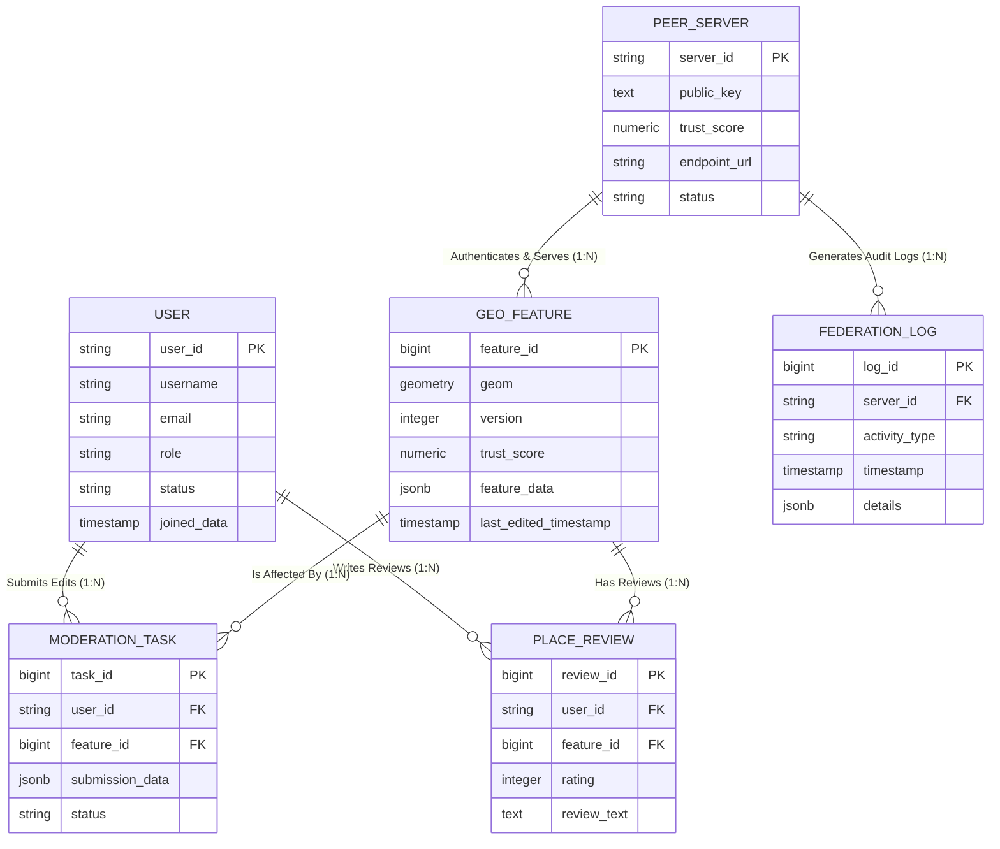
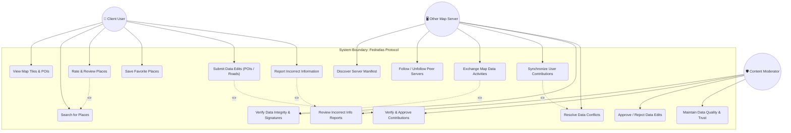
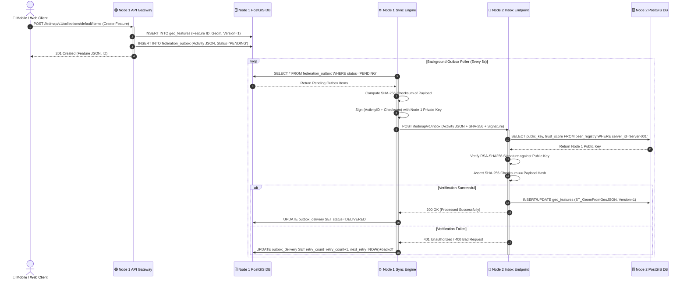

# 🎨 Fedratlas Map — System Design & Architecture Diagrams

This document contains the complete, high-resolution **UML and ER Diagrams** for the **Fedratlas Federated Map Data Sharing and Synchronization System**, designed for Sabaragamuwa University Capstone Final Report documentation (IS 4110 / SE5104).

---

## 1. 🗄️ Entity-Relationship (ER) Diagram

The ER Diagram details the entities, attributes, primary keys (`PK`), foreign keys (`FK`), and cardinalities across the PostGIS spatial database and federation state tables.

---

## 2. 👥 Use Case Diagram

The Use Case Diagram illustrates the interactions between three primary system actors (**Client User**, **Other Map Server**, and **Content Moderator**) and the core functional modules of the Fedratlas protocol.

---

## 3. 🔄 Activity Diagram (Multi-Server Synchronization Workflow)

The Activity Diagram depicts the step-by-step operational decision flow for creating a map feature on Node 1, queueing it in the outbox, delivering it asynchronously over HTTPS, and applying it to Node 2's PostGIS database.

```mermaid
stateDiagram-v2
    direction TB

    [*] --> UserAction: Client Creates / Modifies Spatial Feature

    state "Node 1 (Origin Server)" as Node1 {
        UserAction --> ValidateLocal: Validate GeoJSON & Permissions
        ValidateLocal --> InsertPostGIS: Insert into geo_features Table
        InsertPostGIS --> WriteOutbox: Create Activity in federation_outbox
        WriteOutbox --> ReturnClient: Return 201 Created to Client
    }

    state "Sync Engine (Background Worker)" as SyncWorker {
        ReturnClient --> PollOutbox: Poll Outbox (Every 5 Seconds)
        PollOutbox --> FetchPeers: Fetch Active Peers (status = 'FOLLOWING')
        FetchPeers --> SignPayload: Compute SHA-256 & Sign with Private Key
        SignPayload --> HTTPPost: Send HTTPS POST /fedmap/v1/inbox to Node 2
    }

    state "Node 2 (Receiving Peer Server)" as Node2 {
        HTTPPost --> ReceiveInbox: Receive Payload at /fedmap/v1/inbox
        ReceiveInbox --> LookupKey: Fetch Node 1 Public Key from peer_registry
        LookupKey --> CheckSignature: Verify RSA Signature & SHA-256 Checksum

        state SignatureCheck <<choice>>
        CheckSignature --> SignatureCheck

        SignatureCheck --> RejectActivity: [Signature / Checksum Invalid]
        RejectActivity --> LogError: Record Error in federation_log
        LogError --> ReduceTrust: Decrease Node 1 Trust Score
        ReduceTrust --> Return400: Return 400/401 HTTP Error

        SignatureCheck --> ApplyMutation: [Signature & Checksum Valid]
        ApplyMutation --> PostGISUpsert: Atomic Upsert to geo_features (PostGIS)
        PostGISUpsert --> Return200: Return 200 OK (Success)
    }

    Return200 --> UpdateOutbox: Mark outbox_delivery as 'DELIVERED'
    Return400 --> ScheduleRetry: Increment Retry Count & Exponential Backoff
    UpdateOutbox --> [*]
    ScheduleRetry --> [*]
```

---

## 4. ⏱️ Sequence Diagram (Real-Time Inter-Server Sync Lifecycle)

The Sequence Diagram details the exact message passing lifecycle and HTTP request/response flow between the client application, local backend server, outbox sync workers, peer inbox endpoints, and PostGIS databases.

---
*Diagrams prepared for Sabaragamuwa University Capstone Project Final Report (IS 4110 / SE5104).*
